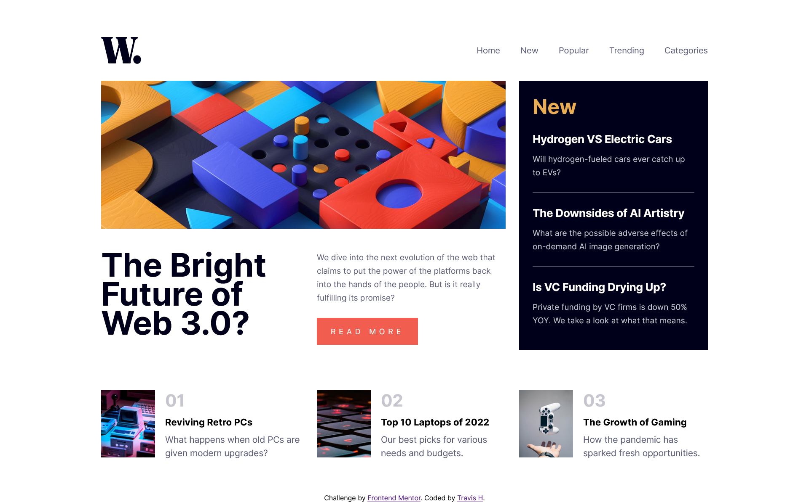
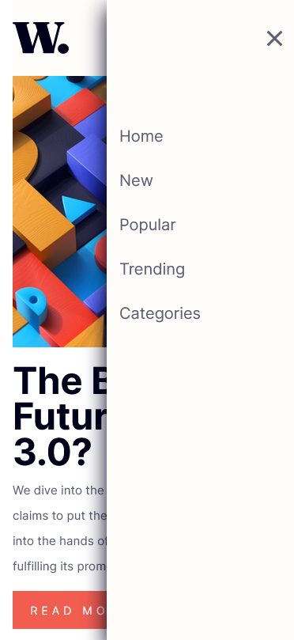

# Frontend Mentor - News homepage solution

This is a solution to the [News homepage challenge on Frontend Mentor](https://www.frontendmentor.io/challenges/news-homepage-H6SWTa1MFl). 

## Table of contents

- [Frontend Mentor - News homepage solution](#frontend-mentor---news-homepage-solution)
  - [Table of contents](#table-of-contents)
  - [Overview](#overview)
    - [The challenge](#the-challenge)
    - [Screenshot](#screenshot)
    - [Links](#links)
  - [My process](#my-process)
    - [Built with](#built-with)
    - [Useful resources](#useful-resources)
  - [Author](#author)

**Note: Delete this note and update the table of contents based on what sections you keep.**

## Overview

### The challenge

Users should be able to:

- View the optimal layout for the interface depending on their device's screen size
- See hover and focus states for all interactive elements on the page

### Screenshot

Desktop View

Mobile Views

### Links

- Solution URL: [Solution URL](https://github.com/TravisH-bot/news-homepage-main)
- Live Site URL: [Live site URL](https://travish-bot.github.io/news-homepage-main/)

## My process

### Built with

- Semantic HTML5 markup
- CSS custom properties
- Flexbox
- Media Queries
- JavaScript

### Useful resources

- [Resource 1](https://alvarotrigo.com/blog/slide-menus/) - This helped me with the sliding mobile menu.
- [Resource 2](https://www.w3schools.com/howto/howto_js_navbar_hide_scroll.asp) - This is a great resource to learn how to hide a mobile nav on scroll.

## Author

- Website - [Travis Hackbarth](https://travish-bot.github.io/My-Portfolio/)
- Frontend Mentor - [@TravisH-bot](https://www.frontendmentor.io/profile/TravisH-bot)

